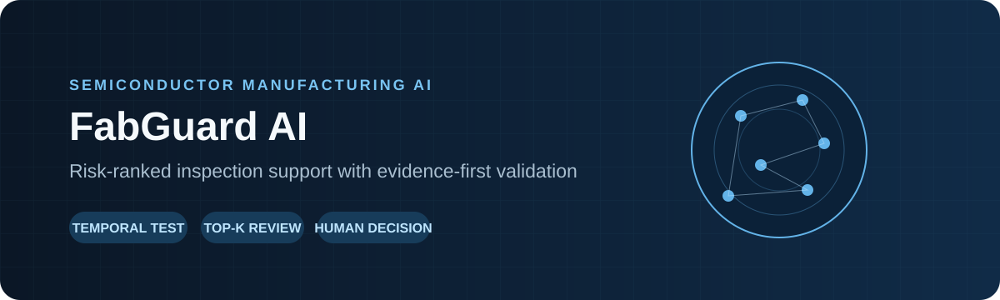
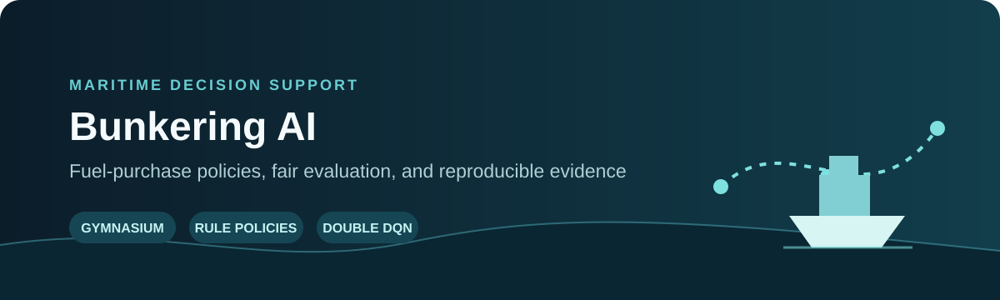
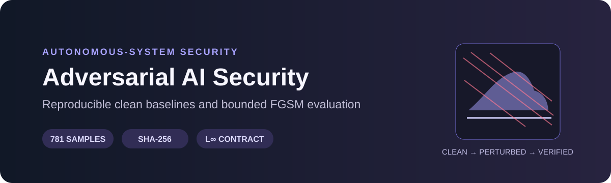
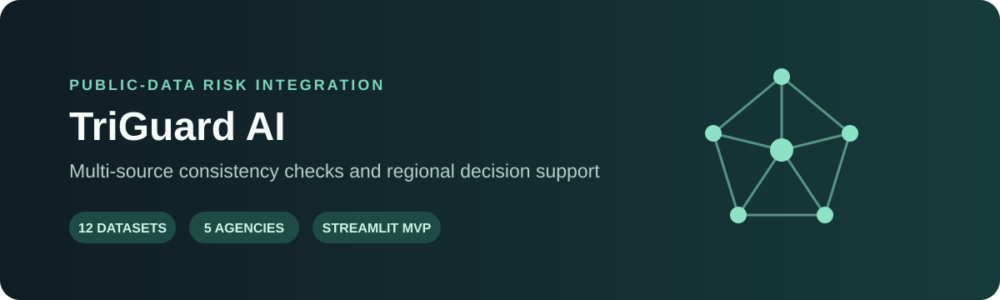

# Heechan Choi · 최희찬

### Evidence-first Industrial AI Project Lead

**Semiconductor Manufacturing · Smart Factory · Maritime Decision Systems · AI Security**

현장 문제를 재현 가능한 실험, 사람이 통제하는 의사결정 지원 시스템, 공개 데모로 연결합니다. 
I turn industrial problems into reproducible experiments, human-in-the-loop decision tools, and reviewable project evidence.

> **What I optimize for:** not the highest-looking metric, but a result whose data, assumptions, failure modes, and ownership can be inspected.

## At a glance

| Focus | What I build | Evidence I leave behind |
|---|---|---|
| Industrial AI | Risk ranking and decision-support prototypes | experiment contracts, baselines, holdouts, result bundles |
| Smart manufacturing | Semiconductor data-quality and inspection workflows | leakage controls, temporal validation, Top-K operational metrics |
| Autonomous systems | Maritime optimization and AI robustness evaluation | simulation environments, adversarial tests, integrity hashes |
| Project leadership | Problem framing through demo and delivery | scope decisions, documentation, GitHub review, public deployment |

### 현재 한 문장

전자공학·스마트팩토리 배경 위에서 **반도체 제조 AI를 중심축으로**, 해양 의사결정과 자율시스템 보안 프로젝트를 검증 가능한 포트폴리오로 만들고 있습니다.

*Building an industrial-AI portfolio centered on semiconductor manufacturing, with adjacent work in maritime decision systems and autonomous-system security.*

## Featured work

### 01 · [FabGuard AI](https://github.com/heechan9/fabguard-ai) — Semiconductor risk prioritization

**Owner / problem framing / validation direction / release decisions**

- UCI SECOM의 생산 기록 1,567건·익명 측정변수 590개를 이용한 고위험 생산 건 우선점검 프로젝트
- 누출 방지 전처리, 시간순 홀드아웃, PR-AUC와 Top-K 포착률, 확률 보정·bootstrap·walk-forward 검증
- 상위 10% 점검에서 불량 5/24건 포착을 확인했지만 자동 판정·수율 개선·현장 배포는 주장하지 않음
- 독립 FabGuard → Fledge 산업 엣지 연계 → 향후 Solar Data Tools 기술 이전의 단계적 오픈소스 로드맵

**Review:** [Live demo](https://fabguard-ai.vercel.app/) · [Experiment contract](https://github.com/heechan9/fabguard-ai/blob/main/EXPERIMENT_CONTRACT.md) · [Roadmap](https://github.com/heechan9/fabguard-ai/blob/main/ROADMAP.md)

---

### 02 · [Bunkering AI](https://github.com/heechan9/bunkering-ai) — Maritime fuel decision support

**Project lead / evaluation direction / system integration**

- Gymnasium 가상 항해 환경에서 규칙 기반 정책 3종과 Double DQN을 동일 조건으로 비교
- 연료 잔량·가격·환율·운항상태를 상태로 연결하고 안전재고와 합성비용의 trade-off를 기록
- 공식 평가에서 DQN의 성공률과 평균 보상은 높았지만 급유횟수·합성비용까지 고려해 전반적 우월성은 주장하지 않음
- 코드, 보고서, 발표, 시연과 논문용 실험기록을 하나의 증거 체계로 관리

**Review:** [Repository](https://github.com/heechan9/bunkering-ai) · [Contributions](https://github.com/heechan9/bunkering-ai/blob/main/CONTRIBUTIONS.md)

---

### 03 · [Adversarial AI Security](https://github.com/th0oel/AdversarialAI_Security) — Autonomous ship AI robustness

**Experiment implementation and validation contributor**

- 선박 이미지 781장의 CNN·MobileNetV2 clean baseline을 재현하고 FGSM 평가 파이프라인 구축
- 공격 전후 성능, attack success rate, L∞ 섭동 경계와 ε=0 smoke test를 검증
- 데이터·모델 SHA-256, 결과 번들, 재현 문서와 기여 기록으로 실험 추적성 확보
- 팀 공식 저장소에 PR 기반으로 기여하며 개인 포크와 공식 프로젝트 소유권을 구분

**Review:** [Team repository](https://github.com/th0oel/AdversarialAI_Security) · [My fork](https://github.com/heechan9/AdversarialAI_Security)

---

### 04 · [TriGuard AI](https://github.com/heechan9/triguard-ai) — Public-data risk intelligence

**Project lead / data and scenario design / MVP delivery**

- 5개 공공기관의 데이터 12종을 통합해 14개 지역의 운영 위험 신호를 점검하는 의사결정 지원 MVP
- 지도·대시보드·위험점수·문서 간 일관성을 독립 감사 도구와 변이 테스트로 검증
- AI가 결정을 대신하지 않도록 위험 신호, 데이터 근거, 인간 검토와 주장 경계를 분리

**Review:** [Repository](https://github.com/heechan9/triguard-ai)

## Evidence map

| Project | Current artifact | My role | Honest boundary |
|---|---|---|---|
| FabGuard AI | offline experiment + web demo + tests | owner and validation lead | no real-fab KPI claim |
| Bunkering AI | simulator + four-policy evaluation | project lead and integrator | synthetic cost is not field cost |
| Adversarial AI | clean/FGSM reproducibility bundle | experiment and validation contributor | team-owned repository; defense work continues |
| TriGuard AI | public-data MVP + consistency audit | project lead and scenario designer | risk score is not an operational order |

## How I work

1. **Frame the operational decision.** 모델보다 먼저 누가 무엇을 판단해야 하는지 정의합니다.
2. **Freeze the experiment contract.** 데이터 분할, 기준선, 평가지표와 금지할 주장을 먼저 기록합니다.
3. **Build with traceability.** 테스트, 해시, 결과 파일, 문서와 PR을 연결합니다.
4. **Report failures explicitly.** 낮은 recall, 변동성, 데이터 한계도 결과로 남깁니다.
5. **Keep a human accountable.** AI 도구의 구현 기여와 사람의 승인·책임을 구분합니다.

## Experience & foundation

| Area | Experience |
|---|---|
| Education | B.E. track in Electronic Engineering; interdisciplinary Smart Factory major, Tech University of Korea |
| Industrial R&D | 미래내일 일경험 — 대유에이텍 R&D 연구소 선행연구팀, 2024 |
| Semiconductor | 반도체 Career Track 44h; semiconductor equipment-engineering job bootcamp 5 weeks, 2026 |
| Maritime ICT | Smart Maritime Logistics × ICT mentoring — project lead and AI-security experiment contributor, 2026 |
| International teamwork | G-STAR × Hanoi — Korea–Vietnam EV battery-material supply-chain and production-location analysis |

## Working stack

> These are tools used in the linked projects, not a claim of equal mastery across every technology.

## Open to collaboration

I welcome focused, issue-based collaboration in:

- industrial-data quality, missingness, drift, and leakage controls
- uncertainty-aware risk ranking and human-in-the-loop evaluation
- semiconductor manufacturing and edge-data adapters
- maritime decision simulation and autonomous-system AI robustness
- reproducibility tests, technical documentation, and experiment review

The fastest way to collaborate is to open a focused issue or pull request in the relevant project with the target problem, data boundary, expected evidence, and acceptance criteria.

## Current direction

- complete the evidence, demonstration, and publication packages for the two maritime AI projects
- strengthen FabGuard as an independent semiconductor-manufacturing AI project
- prepare reusable industrial-data modules for future contribution to external open-source communities
- build the English communication and international teamwork needed for manufacturing-AI collaboration abroad

---

### Build it. Test it. Explain the boundary.

**검증할 수 있는 결과를 만들고, 설명할 수 있는 기술을 쌓습니다.**

