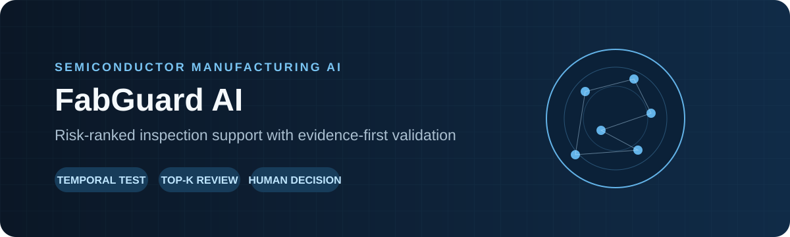
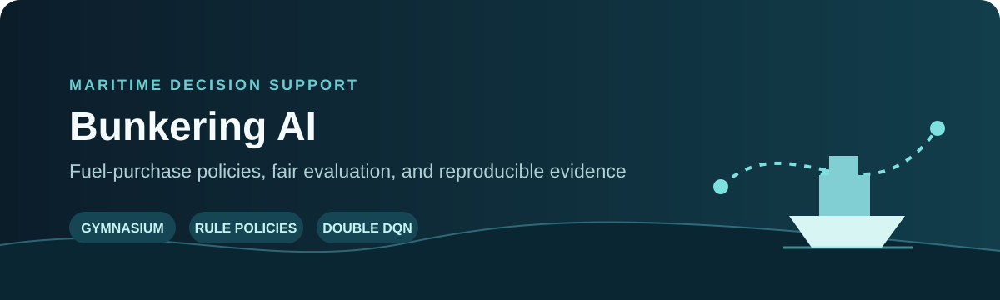
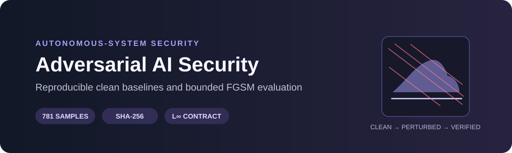
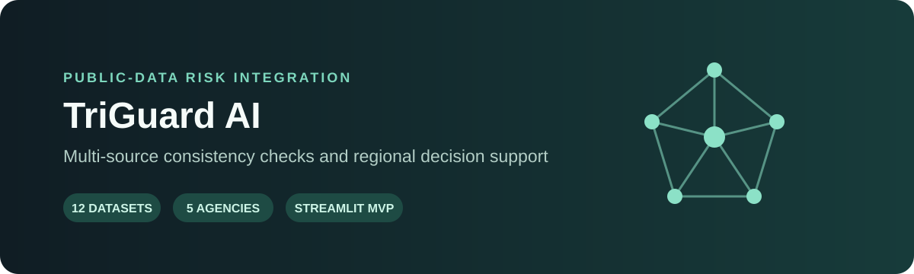

# Heechan Choi

### 반도체 제조와 산업 데이터 분석을 중심으로 프로젝트를 수행하고 있습니다

한국공학대학교 전자공학부 임베디드시스템공학을 전공하고 스마트팩토리를 부전공으로 졸업했습니다. 
2026년에는 공개 반도체 제조데이터 분석, 해양 운항 시뮬레이션, 선박 영상 AI 프로젝트를 진행했습니다. 
**반도체 공정·품질·수율과 스마트제조 분야**에서 일하는 것을 목표로 합니다.

## 프로젝트와 제조 분야의 연결

| 프로젝트 | 다룬 문제 | 제조 분야로 가져가려는 역량 |
|---|---|---|
| FabGuard AI | 불량 비율이 낮은 데이터에서 점검 순서 정하기 | 검사·재검 우선순위 설계, 시간순 평가 |
| Bunkering AI | 연료 구매 정책을 안전성과 비용으로 비교 | 재고 보충·운영 정책을 여러 지표로 비교 |
| Adversarial AI | 선박 영상 분류 모델의 입력 교란 취약성 | 비전 검사 모델의 신뢰성 평가 |
| TriGuard AI | 여러 기관 데이터를 통합한 지역 위험 점검 | 이종 데이터 통합과 배포 전 정합성 검증 |

## 대표 프로젝트 | Featured projects

프로젝트마다 제가 정한 문제와 요구사항, 직접 수행한 실험·검토를 아래에 적었습니다. 코드 구현·테스트·문서 작성에는 Codex 등 AI 도구를 활용했으며, AI가 생성한 부분과 팀원의 기여는 각 기여 기록에 구분했습니다.

### 01 · [FabGuard AI](https://github.com/heechan9/fabguard-ai) — 반도체 생산 건 우선점검

공개 반도체 생산데이터 UCI SECOM(1,567건, 익명 측정변수 590개)은 Fail 비율이 6.6%입니다. 이 데이터에서 점검 대상을 일부로 제한했을 때 Fail을 얼마나 포착하는지 평가했습니다. 모델이 합격/불합격을 판정하는 대신 먼저 볼 순서를 제안하도록 문제를 정의하고, 앞 75% 기간으로 학습한 모델로 뒤 25% 기간을 순위화했습니다. 같은 모델을 0.5 임계값으로 분류하면 평가 구간의 Fail 24건을 하나도 찾지 못해, 순위 기반으로 정의한 이유를 뒷받침했습니다.

평가 구간 392건에서 위험 상위 10%인 40건을 점검했을 때 **Fail 24건 중 5건을 포착**했습니다. 같은 수를 무작위로 점검할 때의 기대값(40 × 24/392 ≈ 2.4건)의 약 2배입니다(V1 모델). 점검 여력이 제한된 상황에서 순위화 신호는 있었지만, 평가 구간 AP(0.094)가 학습 구간 교차검증(0.216)보다 낮아 독립된 제조 데이터로 다시 검증해야 합니다.

> **내 역할** · UCI SECOM으로 고위험 생산 건의 점검 순서를 다루는 주제를 선정하고, 초기 실험 계약과 활용 범위를 제시했습니다. 결과 해석과 공개할 내용을 검토하고 최종 배포를 결정했습니다. [기여 기록](https://github.com/heechan9/fabguard-ai/blob/main/docs/governance/AI_USAGE.md)

**근거:** [실행 데모](https://fabguard-ai.vercel.app/) · [V1 결과와 한계](https://github.com/heechan9/fabguard-ai/blob/main/results/v1/RESULTS_SUMMARY.md) · [보정·부트스트랩 등 추가 검증](https://github.com/heechan9/fabguard-ai/blob/main/docs/PHASE1_ADVANCED_VALIDATION.md) · [실험 계약](https://github.com/heechan9/fabguard-ai/blob/main/docs/validation/EXPERIMENT_CONTRACT.md) · [로드맵](https://github.com/heechan9/fabguard-ai/blob/main/docs/project/ROADMAP.md)

---

### 02 · [Bunkering AI](https://github.com/heechan9/bunkering-ai) — 선박 연료 구매 정책 비교

선박은 연료가 떨어지면 안 되지만, 필요 이상으로 자주 급유하면 비용과 운용 부담이 커집니다. 2026 스마트해운물류×ICT 멘토링에서 팀장을 맡아, 가격·환율·잔량·잔여 항로를 보고 급유 여부를 정하는 정책을 비교했습니다. 초기 규칙 2종은 대부분의 항해에서 연료가 고갈됐습니다. 안정적으로 도착하는 정책과도 비교하기 위해 안전재고 규칙을 추가하고, 규칙 3종과 Double DQN을 같은 난수 조건의 가상 항해 100회로 평가했습니다.

합성 시뮬레이션에서 두 정책은 100회 모두 목적지에 도착했습니다. DQN은 평균 보상이 가장 높았지만, 항해당 급유 행동이 5.31회로 안전재고 규칙(1.00회)보다 많았고 합성 비용지수도 847,118 대 545,393으로 높았습니다. 이 환경의 보상은 가격이 평균보다 낮을 때 급유하면 가점을 주지만 구매량과 구매비용은 반영하지 않습니다. 따라서 **보상을 높이는 행동과 비용을 줄이는 행동이 어긋날 수 있다**는 점을 확인했습니다. 구매비용과 잔여 연료를 보상에 반영하는 설계는 후속 실험 후보입니다.

> **내 역할** · 팀장으로 문제와 요구사항을 정하고, State·Action·Reward 및 평가지표의 방향을 검토했습니다. 안전재고 기준선의 요구사항을 정의하고 작업 배정, 결과 검토, 멘토링 대응과 보고서 통합을 맡았습니다. Windows 독립 재현과 병합은 팀원이 수행했습니다. [기여 기록](https://github.com/heechan9/bunkering-ai/blob/main/CONTRIBUTIONS.md)

**근거:** [저장소](https://github.com/heechan9/bunkering-ai) · [공식 평가와 해석 범위](https://github.com/heechan9/bunkering-ai/blob/main/docs/technical/official_evaluation.md) · [연료수지·보상 진단](https://github.com/heechan9/bunkering-ai/blob/main/docs/technical/reward_diagnostics_results_4seed.md)

---

### 03 · [Adversarial AI Security](https://github.com/th0oel/AdversarialAI_Security) — 선박 영상 분류 모델 강건성

선박 종류를 인식하는 영상 AI는 사람이 알아채기 어려운 작은 입력 교란에도 판단을 바꿀 수 있습니다. 같은 멘토링 과정의 팀 프로젝트로, CNN·MobileNetV2의 정상 정확도를 기준선으로 두고 FGSM 교란 강도(ε)에 따른 변화를 측정했습니다. 공격 성공률은 원래 맞힌 이미지만 분모로 삼아 계산했고, ε=0에서 정상 평가 결과와 일치하는지 확인했습니다.

공개 이미지 781장에서 정상 정확도가 더 높았던 MobileNetV2(78.5%)는 ε=0.01 교란에서 12.4%까지 떨어졌고, CNN은 64.5%에서 41.6%가 됐습니다. 이 실험에서는 정상 정확도가 높은 모델이 교란에 더 강하지 않았습니다. 비전 모델은 정상 정확도와 별도로 입력 변화 조건에서도 시험해야 한다는 점을 보여 준 결과입니다. 단순 필터 방어의 비교 결과는 저장소에 정리했습니다.

> **내 역할** · 검증 범위와 저장소 통합 조건을 정하고, Windows PC에서 원본 781장과 두 모델로 테스트·근거 감사를 직접 실행했습니다(PR #3·#11). 가우시안·평균 필터 비교 실험도 직접 실행해 원본 결과 파일을 제공했습니다. 이미지 시각 검토는 팀원이 수행했습니다. [기여 기록](https://github.com/th0oel/AdversarialAI_Security/blob/main/CONTRIBUTIONS.md)

**근거:** [팀 공식 저장소](https://github.com/th0oel/AdversarialAI_Security) · [내 포크](https://github.com/heechan9/AdversarialAI_Security) · [FGSM·필터 방어 결과](https://github.com/th0oel/AdversarialAI_Security/blob/main/docs/CURRENT_RESEARCH_STATUS.md)

---

### 04 · [TriGuard AI](https://github.com/heechan9/triguard-ai) — 공공데이터 기반 지역 병력운용 위험 점검

병무청·질병관리청·방위사업청 등 5개 기관의 데이터 12종은 형식과 기준이 달라, 지방청별 인력 운용 위험을 한눈에 비교하기 어렵습니다. 2026 공공데이터·AI 활용 경진대회 팀 프로젝트로, 인력·감염병·물자 지표를 합친 위험점수와 지도 대시보드를 만들었습니다. 담당자가 원자료 시점과 세부 지표를 확인한 뒤 판단하도록 설계했습니다. 공개 통계 화면에는 정의한 원본 대조 항목의 불일치를 배포 전에 탐지하는 검증기를 두었습니다. 대조 항목은 원본 해시, 연도·지방청 키 중복, 행 누락, 수치, 전국 합계, 다운로드 CSV입니다.

원본 교체, 행 중복·누락, 수치 변경, 다운로드 파일 손상, 잘못된 인원 수 값을 주입한 테스트 사례에서 검증기는 각 불일치를 오류로 탐지했습니다. 빌드는 검증에 실패하면 새 배포 산출물을 만들지 않습니다. 위험점수는 아직 실제 사후 지표와 비교해 검증하지 않았습니다.

> **내 역할** · 서비스 방향과 요구사항을 정하고, 사용할 공공데이터와 활용 시나리오를 선정했습니다. 구현 결과를 검토하고 저장소 운영을 맡았습니다. [기여 기록](https://github.com/heechan9/triguard-ai/blob/main/CONTRIBUTIONS.md)

**근거:** [저장소](https://github.com/heechan9/triguard-ai) · [요구사항–검증 연결표](https://github.com/heechan9/triguard-ai/blob/main/docs/LECTURE_APPLICATION.md)

## 현재 작업 | Current work

- **산업설비 시계열 데이터 품질.** FabGuard에서 설비 데이터 처리를 시험했습니다. 로컬 Fledge v3.1.0과 연동해 수집·재시작·중복 처리를 확인했고, Solar Data Tools로 공개 태양광 발전 시계열(호주·영국·프랑스 등)의 결측·품질 리포트를 생성했습니다. 실제 설비 센서 데이터가 아니라 공개 시계열에 품질 점검 방법을 먼저 적용해 본 단계입니다.
- **SPC 점검.** 개별값 관리도(NIST 식) 기반 CSV 점검 도구를 합성 데이터로 구현했습니다.

## 기술 협업 | Technical collaboration

산업 데이터 품질, 제한된 점검 여력에서의 위험 순위화, 산업설비 시계열 분야의 기술 검토와 협업을 환영합니다. 관련 저장소의 Issue에 문제, 데이터 범위, 기대하는 결과를 남겨 주세요.

*Open to issue-based technical review on industrial data quality, risk ranking under inspection budgets, and equipment time-series pipelines. See the [FabGuard review brief](https://github.com/heechan9/fabguard-ai/blob/main/docs/MELBOURNE_COLLABORATION.md).*

## 경험과 기반 | Experience

| 영역 | 경험 |
|---|---|
| 학력 | 한국공학대학교 전자공학부 임베디드시스템공학 전공 · 스마트팩토리 부전공 졸업 |
| 산업 R&D | 미래내일 일경험 — 대유에이텍 R&D 연구소 선행연구팀, 2024 |
| 반도체 공정 교육 | 데이터기반 반도체 Photo 공정(NCS, 코멘토), 2026 · FAB 공정실습(서울테크노파크), 2026 |
| 반도체 설비·소자 교육 | 설비기술 직무부트캠프 〈반도체 장비 엔지니어 A to Z〉(코멘토), 2025 · 첨단산업 인재양성 부트캠프 〈반도체 소자 및 설계〉(한국공학대), 2023~2024 |
| 해양 ICT | 스마트해운물류×ICT 멘토링 — Bunkering AI 팀장, Adversarial AI 팀원, 2026 |
| 국제협업 | G-STAR×Hanoi — 한·베 EV 배터리 소재 공급망 및 생산입지 분석 |

<b>반도체·제조 교육 전체 목록</b>

| 구분 | 과정 | 기관 | 기간 | 시간 |
|---|---|---|---|---|
| 공정 | 데이터기반 반도체 Photo 공정 (NCS 반도체개발 19030601) | 고용노동부 K-Digital Credit · ㈜코멘토 | 2026.05~06 | |
| 공정 | FAB 공정실습 | 서울테크노파크 | 2026.09.15 | |
| 산업·직무 | 반도체 산업·직무 과정 | 서울과학기술대학교 × ㈜테크맥스 | 2026.07~09 | |
| 산업·직무 | One Shot 반도체 커리어 트랙 | 이공계 핵심인재양성 평생교육원(렛유인) | 2026.03~04 | 44시간 |
| 특강 | 반도체 패키징 기술 특강 (첨단 AI 칩용, 김진규 강사) | 중소벤처기업부 · 중소벤처기업진흥공단 · 한국공학대학교 | 2025.12.05 | 6시간 |
| 설비 | 설비기술 직무부트캠프 〈반도체 장비 엔지니어 A to Z〉 | ㈜코멘토 | 2025.06~07 | |
| 소자 | 첨단산업 인재양성 부트캠프 〈반도체 소자 및 설계〉 | 교육부 · 한국공학대학교 반도체인력양성사업단 | 2023.10.20~2024.02.23 | |
| 스마트제조 | 스마트공장 실무과정 (개론·생산관리·SSD 제품 생산·MES) | 중소벤처기업부 · 중소벤처기업진흥공단 | 2023.05~08 | |

## 사용 기술 | Working stack

---

*Electronics engineering graduate (embedded systems; minor in smart factory) aiming at semiconductor process, quality and yield engineering and smart manufacturing. In 2026, I worked on risk ranking with public semiconductor production data, policy comparison in a maritime fuel-purchasing simulation, and robustness testing of ship-image classifiers.*
